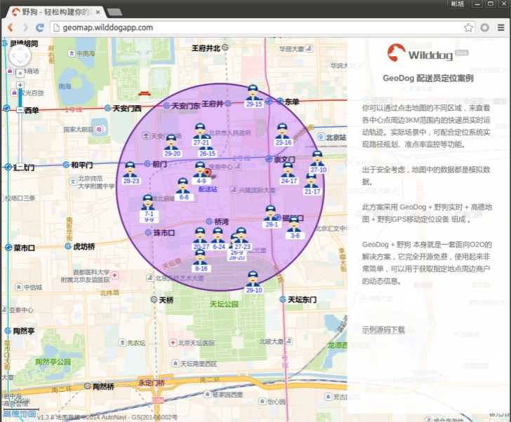

# demo-js-geomap

demo-js-geomap 是一个基于wilddog JavaScript SDK和高德LBS开放平台完成的一个地图应用，能够实现实时的geohash范围查询。

## 在线示例
http://geomap.wilddogapp.com/

我们提供了一个实例，展示在北京市某片区域内的某快递公司快递员的实时动态位置信息，点击地图内的任意点更改紫色圆圈的位置。
[](http://geomap.wilddogapp.com/)


## 本地运行

首先确认本机已经安装 [Node.js](http://nodejs.org/) 运行环境，然后执行下列指令：

```
git clone git@github.com:WildDogTeam/demo-js-geomap.git
cd  demo-js-geomap
```

安装依赖：

```
npm install grunt -g
npm install
```

启动项目：

```
grunt
```

## 依赖项目

* [lib-js-wildgeo](https://github.com/WildDogTeam/lib-js-wildgeo) 基于地理坐标位置存储，使用存储位置坐标的geo hash值查询附近的信息。结合野狗实时系统，能够动态跟踪给定的地理区域内移动的数据。


## 注册Wilddog
WildGeo需要用Wilddog数据库存储位置数据， 你可以在此[注册](https://www.wilddog.com/my-account/signup)Wilddog账户

## 更多示例

这里分类汇总了 WildDog平台上的示例程序和开源应用，　链接地址：[https://github.com/WildDogTeam/wilddog-demos](https://github.com/WildDogTeam/wilddog-demos)

## 支持
如果在使用过程中有任何问题，请提 [issue](https://github.com/WildDogTeam/demo-js-geomap/issues) ，我会在 Github 上给予帮助。

## 相关文档

* [Wilddog 概览](https://z.wilddog.com/overview/guide)
* [JavaScript SDK快速入门](https://z.wilddog.com/web/quickstart)
* [JavaScript SDK 开发向导](https://z.wilddog.com/web/guide/1)
* [JavaScript SDK API](https://z.wilddog.com/web/api)
* [下载页面](https://www.wilddog.com/download/)
* [Wilddog FAQ](https://z.wilddog.com/faq/qa)

## License
MIT
http://wilddog.mit-license.org/

## 感谢 Thanks

demo-js-geomap is built on and with the aid of several  projects. We would like to thank the following projects for helping us achieve our goals:

Open Source:

* [GeoFire](https://github.com/firebase/geofire-js) Realtime location queries with Firebase
* [JQuery](http://jquery.com) The Write Less, Do More, JavaScript Library

Commercial Partner：

* [高德开放平台](http://lbs.amap.com)  高德地图api,高德地图API,地图API,地图api,高德地图 api,高德手机API,LBS云,高德地图API Android,高德地图API iOS,URI API,最专业的地图API
