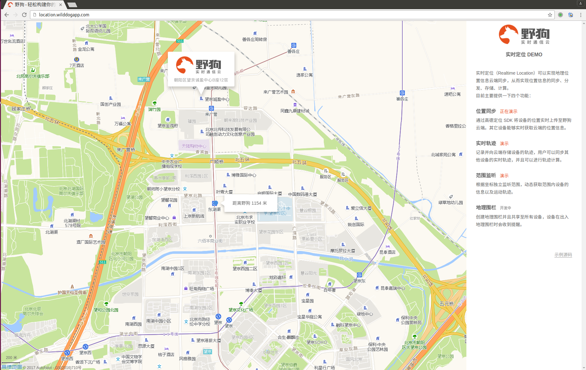
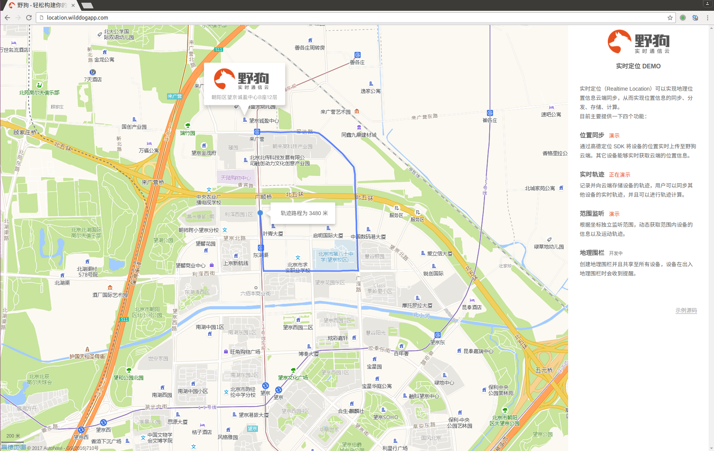
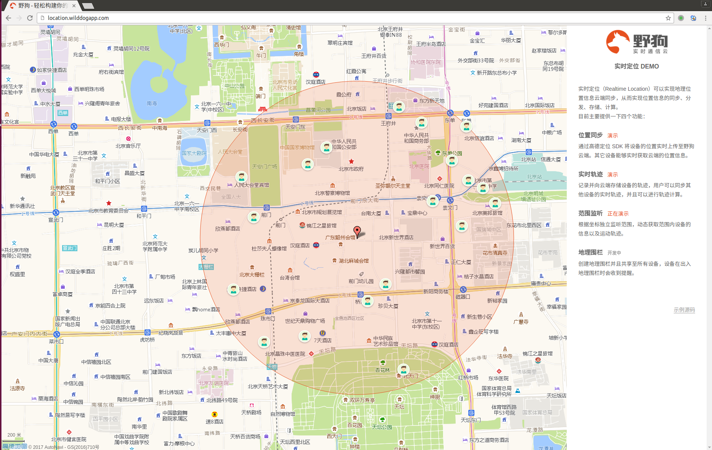

# Wilddog Realtime Location

Realtime Location 是一个基于wilddog JavaScript SDK和高德LBS开放平台完成的一个地图应用，能够实现实时的geohash范围查询。

## 在线示例
http://location.wilddogapp.com/

我们提供了一个实例，包含三大功能：

##### 一、
获取某个定位单位的实时位置。
[](http://location.wilddogapp.com/)

##### 二、
获取某个定位单位的实时路径。
[](http://location.wilddogapp.com/)

##### 三、
展示在北京市某片区域内定位单位的实时动态位置信息，点击地图内的任意点更改橙色圆圈的位置。
[](http://location.wilddogapp.com/)


## 本地运行

首先确认本机已经安装 [Node.js](http://nodejs.org/) 运行环境，然后执行下列指令：

```
git clone git@github.com:WildDogTeam/demo-js-geomap.git
cd  demo-js-geomap
```

安装依赖：

```
npm install grunt -g
npm install
```

启动项目：

```
grunt
```

## 移植到你的野狗App
此时你就可以看到实时移动的定位单位了，该应用用的是我们的AppId, 如果你想移植到自己的野狗 App 上，那怎么组织野狗中的数据呢？
我们在代码中的 dataInitAndMoveSimulator 中提供了初始化数据的 dataInit/datainit.js 和模拟位置坐标实时变化的 moveSimulator/index.js 两个 nodejs 脚本工程，工程使用前需要分别下载依赖 npm install 。

* 首先修改 app/scripts/delivery.js 中的 AppId 为你的野狗App的 AppId
* dataInit：将代码中的 <AppId> 换成你的 AppId，npm install，运行 nodejs 脚本。
* moveSimulator：将代码中的 <AppId> 换成你的 AppId，npm install，运行 nodejs 脚本。
* 完成以上步骤之后，按照上面的启动项目步骤启动即可。


## 注册Wilddog
WildGeo需要用Wilddog数据库存储位置数据， 你可以在此[注册](https://www.wilddog.com/my-account/signup)Wilddog账户

## 更多示例

这里分类汇总了 WildDog平台上的示例程序和开源应用，　链接地址：[https://github.com/WildDogTeam/wilddog-demos](https://github.com/WildDogTeam/wilddog-demos)

## 支持
如果在使用过程中有任何问题，请提 [issue](https://github.com/WildDogTeam/demo-js-geomap/issues) ，我会在 Github 上给予帮助。

## 相关文档

* [Wilddog 概览](https://docs.wilddog.com/overview/index.html)
* [Realtime Location SDK 快速入门](https://docs.wilddog.com/location/Web/quickstart/quickstart.html)
* [Realtime Location SDK API](https://docs.wilddog.com/location/Web/api/AMapLocationProvider.html)
* [Sync SDK 快速入门](https://docs.wilddog.com/sync/Web/quickstart.html)
* [Sync SDK API](https://docs.wilddog.com/sync/Web/api/App.html)

## License
MIT
http://wilddog.mit-license.org/

## 感谢 Thanks

demo-js-geomap is built on and with the aid of several  projects. We would like to thank the following projects for helping us achieve our goals:

Open Source:

* [GeoFire](https://github.com/firebase/geofire-js) Realtime location queries with Firebase
* [JQuery](http://jquery.com) The Write Less, Do More, JavaScript Library

Commercial Partner：

* [高德开放平台](http://lbs.amap.com)  高德地图api,高德地图API,地图API,地图api,高德地图 api,高德手机API,LBS云,高德地图API Android,高德地图API iOS,URI API,最专业的地图API
